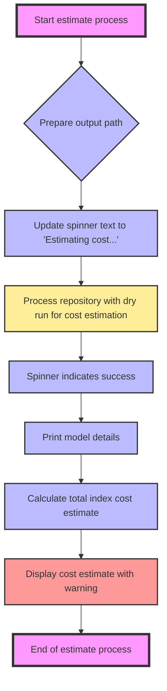

```mermaid
flowchart TD
    A[Start estimate process] --> B{Prepare output path}
    B --> C[Update spinner text to 'Estimating cost...']
    C --> D[Process repository with dry run for cost estimation]
    D --> E[Spinner indicates success]
    E --> F[Print model details]
    F --> G[Calculate total index cost estimate]
    G --> H[Display cost estimate with warning]
    H --> I[End of estimate process]

    classDef startend fill:#f9f,stroke:#333,stroke-width:4px;
    classDef operation fill:#bbf,stroke:#333,stroke-width:2px;
    classDef process fill:#fe9,stroke:#333,stroke-width:2px;
    classDef warning fill:#f99,stroke:#333,stroke-width:2px;

    class A,I startend;
    class B,C,E,F,G operation;
    class D process;
    class H warning;
```