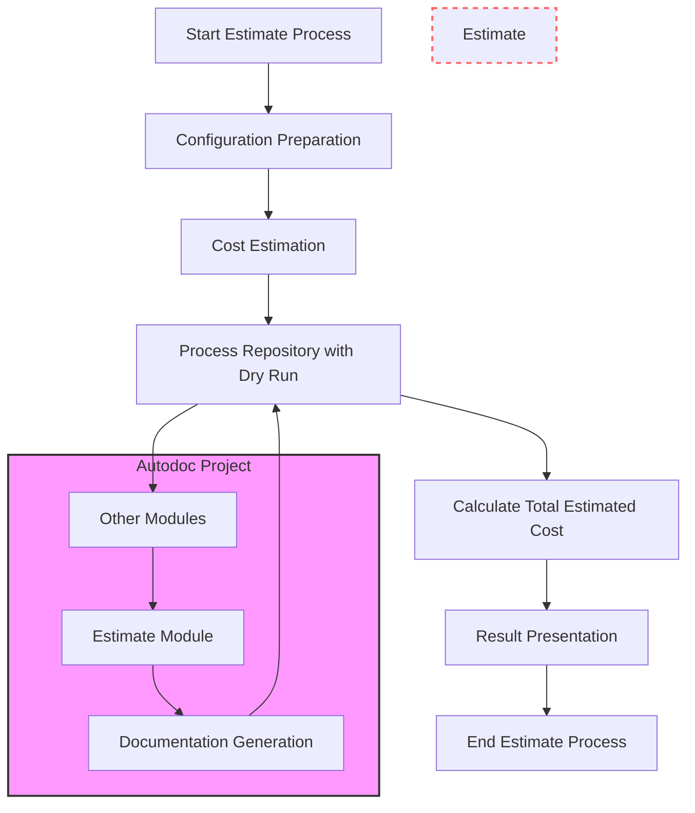

```mermaid
graph TD
    A[Start Estimate Process] --> B[Configuration Preparation]
    B --> C[Cost Estimation]
    C --> D[Process Repository with Dry Run]
    D --> E[Calculate Total Estimated Cost]
    E --> F[Result Presentation]
    F --> G[End Estimate Process]

    subgraph autodoc_project [Autodoc Project]
        direction TB
        H[Other Modules] --> I[Estimate Module]
        I --> J[Documentation Generation]
    end

    D --> H
    J --> D

    style autodoc_project fill:#f9f,stroke:#333,stroke-width:2px
    style Estimate Module fill:#bbf,stroke:#f66,stroke-width:2px,stroke-dasharray: 5 5
```