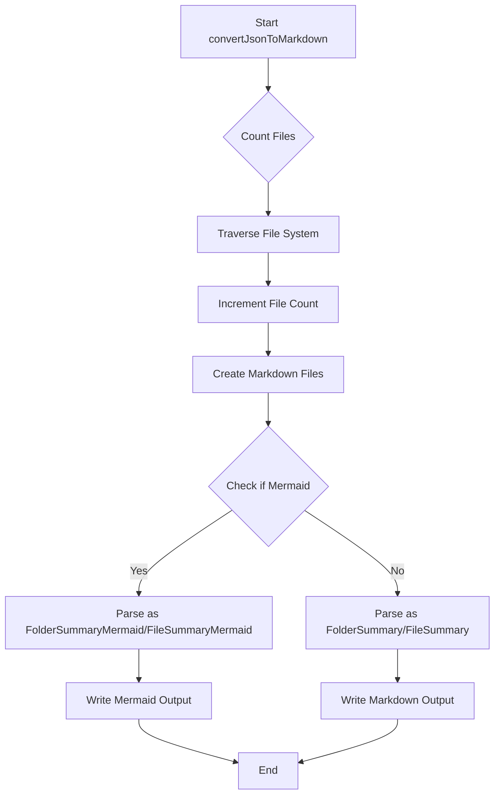

```mermaid
graph TD
    A[Start convertJsonToMarkdown] --> B{Count Files}
    B --> C[Traverse File System]
    C --> D[Increment File Count]
    D --> E[Create Markdown Files]
    E --> F{Check if Mermaid}
    F -->|Yes| G[Parse as FolderSummaryMermaid/FileSummaryMermaid]
    F -->|No| H[Parse as FolderSummary/FileSummary]
    G --> I[Write Mermaid Output]
    H --> J[Write Markdown Output]
    I --> K[End]
    J --> K[End]
```