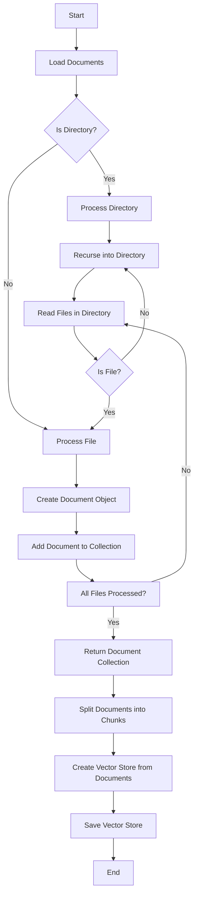

This flowchart represents the process of loading, processing, and vectorizing documents within a directory for the autodoc project. It starts with loading documents, where it checks if the current path is a directory or a file. If it's a directory, it processes each file within, recursing into nested directories as needed. Each file is processed into a Document object, which is then added to a collection. Once all files are processed, the collection of documents is split into chunks. These chunks are then used to create a vector store, which is finally saved to a specified output location.