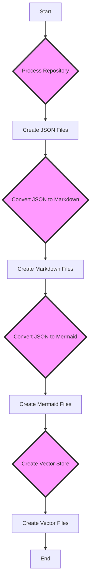

```markdown

```mermaid
graph TD
    A[Start] --> B{Process Repository}
    B --> C[Create JSON Files]
    C --> D{Convert JSON to Markdown}
    D --> E[Create Markdown Files]
    E --> F{Convert JSON to Mermaid}
    F --> G[Create Mermaid Files]
    G --> H{Create Vector Store}
    H --> I[Create Vector Files]
    I --> J[End]

    style B fill:#f9f,stroke:#333,stroke-width:4px
    style D fill:#f9f,stroke:#333,stroke-width:4px
    style F fill:#f9f,stroke:#333,stroke-width:4px
    style H fill:#f9f,stroke:#333,stroke-width:4px
```
```