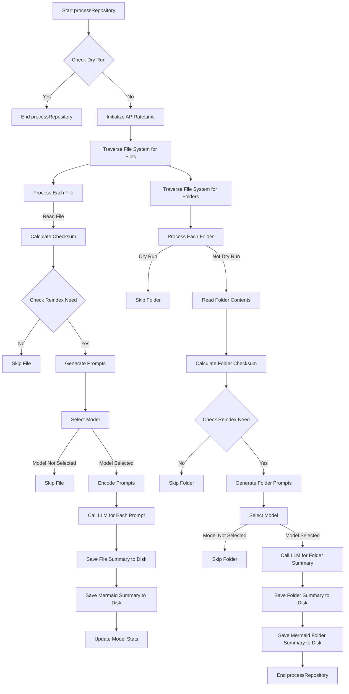

```mermaid
graph TD
    A[Start processRepository] --> B{Check Dry Run}
    B -->|Yes| B1[End processRepository]
    B -->|No| C[Initialize APIRateLimit]
    C --> D[Traverse File System for Files]
    D --> E[Process Each File]
    E -->|Read File| F[Calculate Checksum]
    F --> G{Check Reindex Need}
    G -->|No| G1[Skip File]
    G -->|Yes| H[Generate Prompts]
    H --> I[Select Model]
    I -->|Model Not Selected| I1[Skip File]
    I -->|Model Selected| J[Encode Prompts]
    J --> K[Call LLM for Each Prompt]
    K --> L[Save File Summary to Disk]
    L --> M[Save Mermaid Summary to Disk]
    M --> N[Update Model Stats]
    D --> O[Traverse File System for Folders]
    O --> P[Process Each Folder]
    P -->|Dry Run| P1[Skip Folder]
    P -->|Not Dry Run| Q[Read Folder Contents]
    Q --> R[Calculate Folder Checksum]
    R --> S{Check Reindex Need}
    S -->|No| S1[Skip Folder]
    S -->|Yes| T[Generate Folder Prompts]
    T --> U[Select Model]
    U -->|Model Not Selected| U1[Skip Folder]
    U -->|Model Selected| V[Call LLM for Folder Summary]
    V --> W[Save Folder Summary to Disk]
    W --> X[Save Mermaid Folder Summary to Disk]
    X --> Y[End processRepository]
```