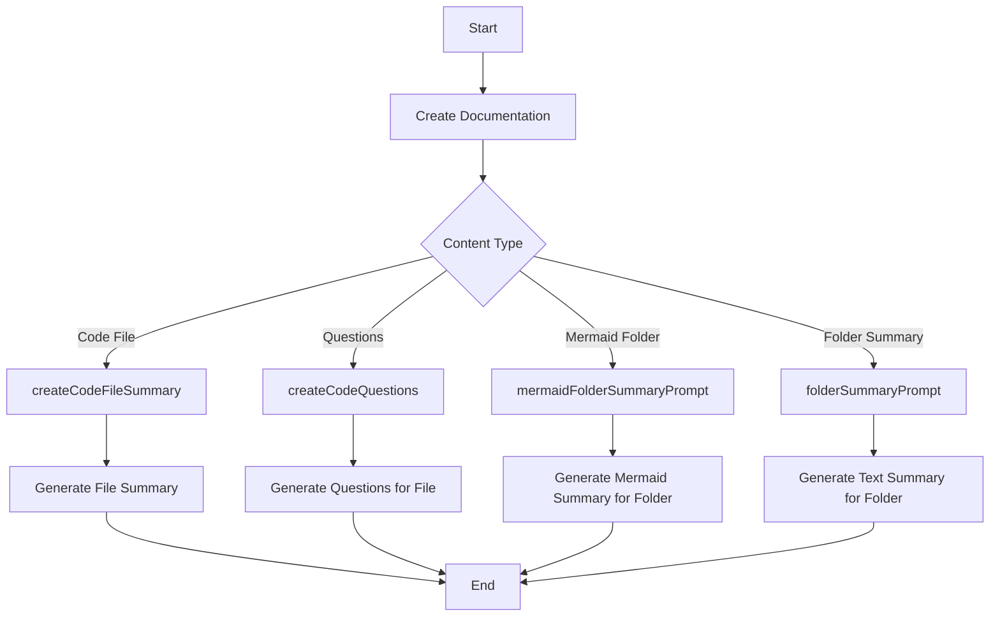

```mermaid
graph TD;
    A[Start] --> B[Create Documentation]
    B --> C{Content Type}
    C -->|Code File| D[createCodeFileSummary]
    C -->|Questions| E[createCodeQuestions]
    C -->|Mermaid Folder| F[mermaidFolderSummaryPrompt]
    C -->|Folder Summary| G[folderSummaryPrompt]
    D --> H[Generate File Summary]
    E --> I[Generate Questions for File]
    F --> J[Generate Mermaid Summary for Folder]
    G --> K[Generate Text Summary for Folder]
    H --> L[End]
    I --> L
    J --> L
    K --> L
```