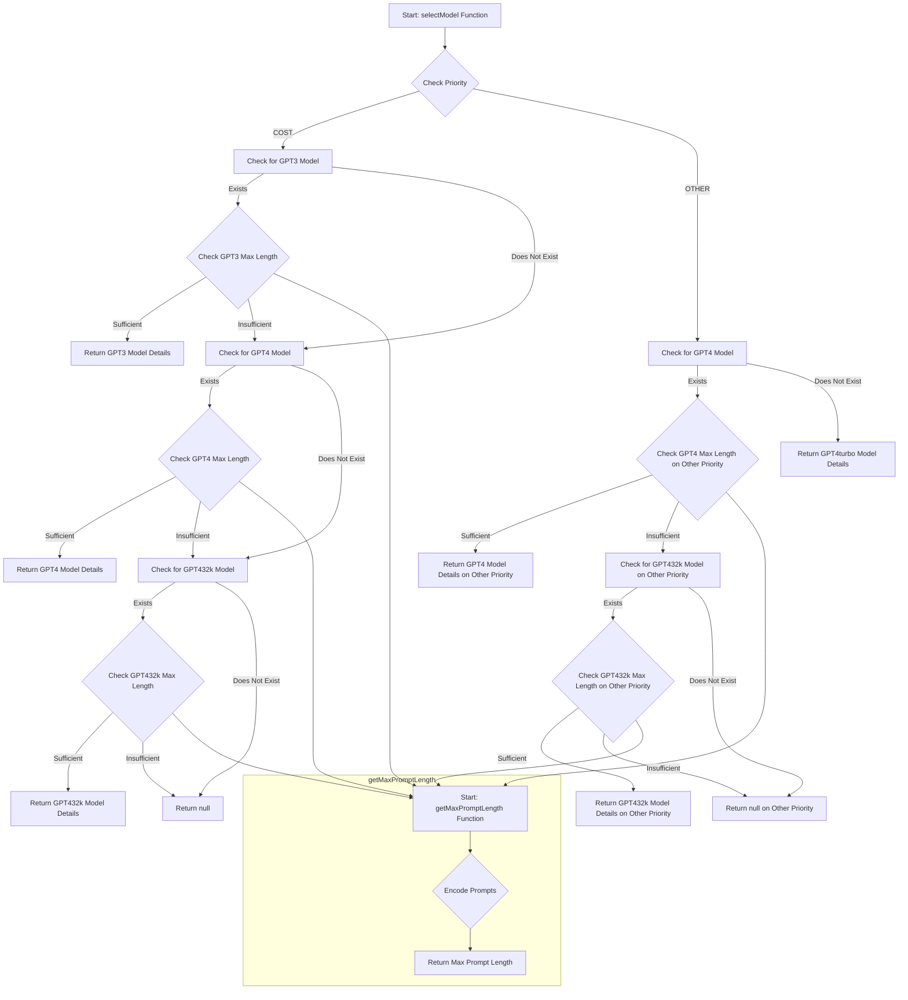

This mermaid diagram illustrates the flow of the `selectModel` function, detailing how it decides which model to return based on priority and the sufficiency of the model's maximum length compared to the encoded prompt lengths. The `getMaxPromptLength` function is represented as a subgraph to show its role in calculating the maximum length of the encoded prompts, which is a crucial step in the decision-making process of the `selectModel` function.