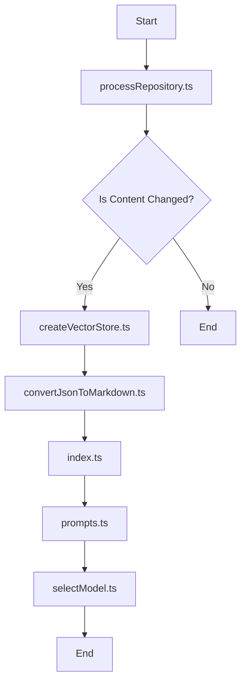

```mermaid
graph TD
    A[Start] --> B[processRepository.ts]
    B --> C{Is Content Changed?}
    C -->|Yes| D[createVectorStore.ts]
    C -->|No| E[End]
    D --> F[convertJsonToMarkdown.ts]
    F --> G[index.ts]
    G --> H[prompts.ts]
    H --> I[selectModel.ts]
    I --> J[End]

    class A,B,E,J startend;
    class C decision;
    class D,F,G,H,I process;
```