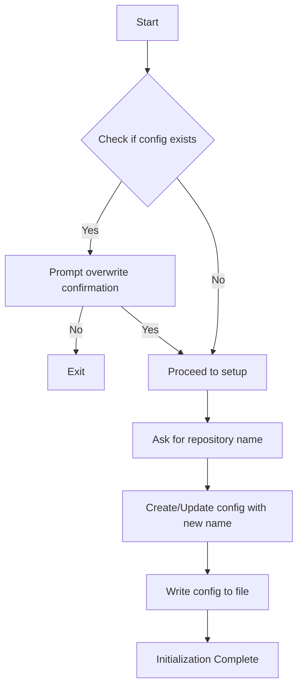

```markdown

```mermaid
graph TD;
    A[Start] --> B{Check if config exists};
    B -- Yes --> C[Prompt overwrite confirmation];
    C -- No --> D[Exit];
    C -- Yes --> E[Proceed to setup];
    B -- No --> E;
    E --> F[Ask for repository name];
    F --> G[Create/Update config with new name];
    G --> H[Write config to file];
    H --> I[Initialization Complete];
```
```