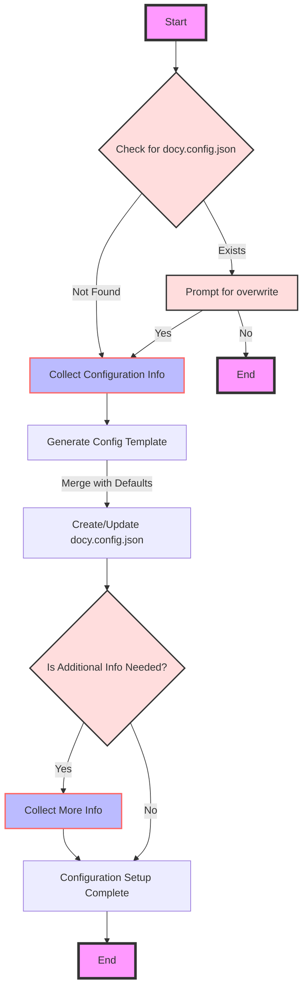

```mermaid
graph TD
    A[Start] --> B{Check for docy.config.json}
    B -->|Exists| C[Prompt for overwrite]
    C -->|Yes| D[Collect Configuration Info]
    C -->|No| E[End]
    B -->|Not Found| D
    D --> F[Generate Config Template]
    F -->|Merge with Defaults| G[Create/Update docy.config.json]
    G --> H{Is Additional Info Needed?}
    H -->|Yes| I[Collect More Info]
    H -->|No| J[Configuration Setup Complete]
    I --> J
    J --> K[End]

    classDef startend fill:#f9f,stroke:#333,stroke-width:4px;
    classDef operation fill:#bbf,stroke:#f66,stroke-width:2px;
    classDef decision fill:#fdd,stroke:#333,stroke-width:2px;
    class A startend;
    class B,C,H decision;
    class D,I operation;
    class E,K startend;
```