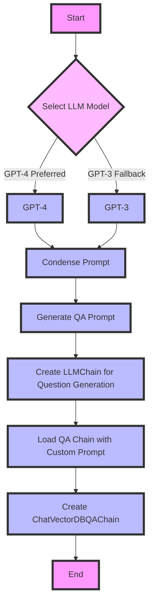

This flowchart represents the process of selecting a language model (either GPT-4 or GPT-3 as a fallback), generating a condensed prompt, creating a question and answer (QA) prompt, and then assembling these components into a `ChatVectorDBQAChain`. This chain is designed to generate questions and provide answers with context from a software project, including hyperlinks back to GitHub where appropriate. The process involves customizing prompts based on project details and audience, and it integrates with a vector store for document retrieval and a language model for natural language processing.