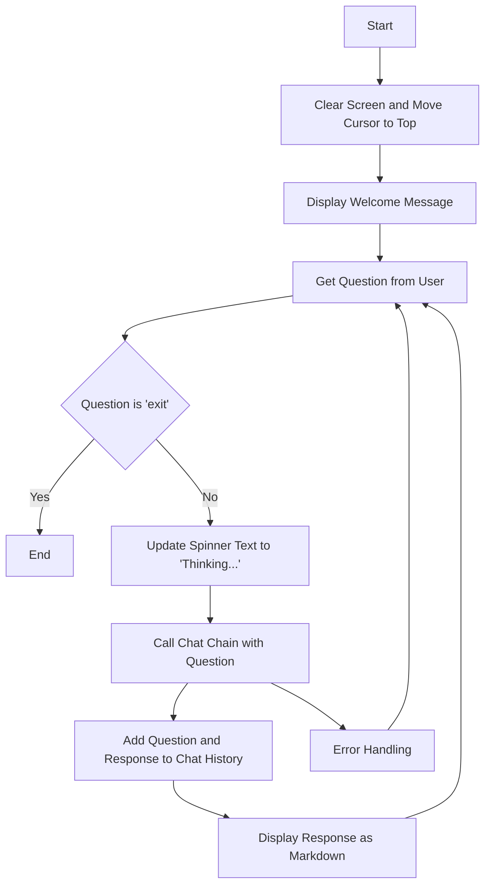

This flowchart represents the steps taken by the code to interact with the user, process their questions, and display responses. The process starts with clearing the screen and displaying a welcome message. It then enters a loop where it prompts the user for a question, processes the question through a chat chain, and displays the response in markdown format. If an error occurs during the processing of the question, it is handled gracefully, and the user is prompted again. The loop continues until the user types 'exit'.