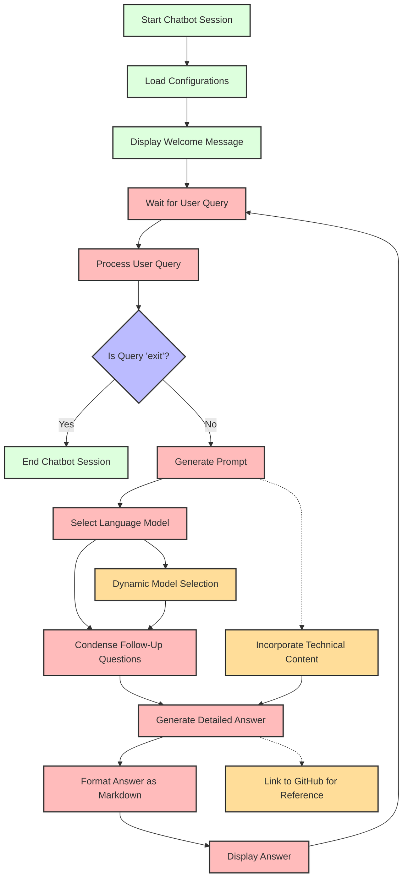

```mermaid
graph TD
    A[Start Chatbot Session] --> B[Load Configurations]
    B --> C[Display Welcome Message]
    C --> D[Wait for User Query]
    D --> E[Process User Query]
    E --> F{Is Query 'exit'?}
    F -- Yes --> G[End Chatbot Session]
    F -- No --> H[Generate Prompt]
    H --> I[Select Language Model]
    I --> J[Condense Follow-Up Questions]
    J --> K[Generate Detailed Answer]
    K --> L[Format Answer as Markdown]
    L --> M[Display Answer]
    M --> D
    I --> N[Dynamic Model Selection]
    N --> J
    K -.-> O[Link to GitHub for Reference]
    H -.-> P[Incorporate Technical Content]
    P --> K

    classDef default fill:#f9f,stroke:#333,stroke-width:2px;
    classDef decision fill:#bbf,stroke:#333,stroke-width:2px;
    classDef process fill:#fbb,stroke:#333,stroke-width:2px;
    classDef io fill:#dfd,stroke:#333,stroke-width:2px;
    classDef link fill:#fd9,stroke:#333,stroke-width:2px;
    class F decision;
    class A,B,C,G io;
    class D,E,H,I,J,K,L,M process;
    class N,O,P link;
```