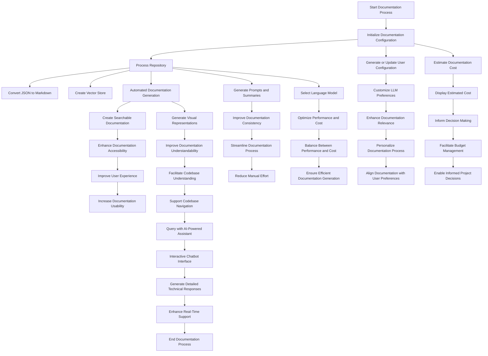

```mermaid
graph TD
    A[Start Documentation Process] --> B[Initialize Documentation Configuration]
    B --> C[Generate or Update User Configuration]
    B --> D[Estimate Documentation Cost]
    B --> E[Process Repository]
    E --> F[Convert JSON to Markdown]
    E --> G[Create Vector Store]
    E --> H[Generate Prompts and Summaries]
    E --> I[Select Language Model]
    C --> J[Customize LLM Preferences]
    D --> K[Display Estimated Cost]
    E --> L[Automated Documentation Generation]
    L --> M[Create Searchable Documentation]
    L --> N[Generate Visual Representations]
    H --> O[Improve Documentation Consistency]
    I --> P[Optimize Performance and Cost]
    J --> Q[Enhance Documentation Relevance]
    K --> R[Inform Decision Making]
    M --> S[Enhance Documentation Accessibility]
    N --> T[Improve Documentation Understandability]
    O --> U[Streamline Documentation Process]
    P --> V[Balance Between Performance and Cost]
    Q --> W[Personalize Documentation Process]
    R --> X[Facilitate Budget Management]
    S --> Y[Improve User Experience]
    T --> Z[Facilitate Codebase Understanding]
    U --> AA[Reduce Manual Effort]
    V --> AB[Ensure Efficient Documentation Generation]
    W --> AC[Align Documentation with User Preferences]
    X --> AD[Enable Informed Project Decisions]
    Y --> AE[Increase Documentation Usability]
    Z --> AF[Support Codebase Navigation]
    AF --> AG[Query with AI-Powered Assistant]
    AG --> AH[Interactive Chatbot Interface]
    AH --> AI[Generate Detailed Technical Responses]
    AI --> AJ[Enhance Real-Time Support]
    AJ --> AK[End Documentation Process]
```