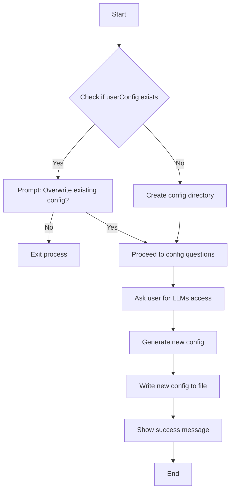

```markdown

```mermaid
graph TD
    A[Start] --> B{Check if userConfig exists}
    B -->|Yes| C[Prompt: Overwrite existing config?]
    C -->|No| D[Exit process]
    C -->|Yes| E[Proceed to config questions]
    B -->|No| F[Create config directory]
    F --> E
    E --> G[Ask user for LLMs access]
    G --> H[Generate new config]
    H --> I[Write new config to file]
    I --> J[Show success message]
    J --> K[End]
```
```