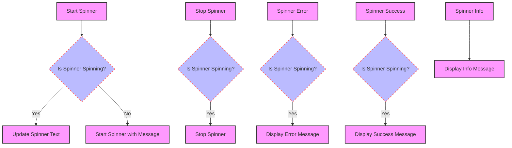

```markdown

```mermaid
graph TD;
    A[Start Spinner] --> B{Is Spinner Spinning?}
    B -->|Yes| C[Update Spinner Text]
    B -->|No| D[Start Spinner with Message]
    E[Stop Spinner] --> F{Is Spinner Spinning?}
    F -->|Yes| G[Stop Spinner]
    H[Spinner Error] --> I{Is Spinner Spinning?}
    I -->|Yes| J[Display Error Message]
    K[Spinner Success] --> L{Is Spinner Spinning?}
    L -->|Yes| M[Display Success Message]
    N[Spinner Info] --> O[Display Info Message]

    classDef default fill:#f9f,stroke:#333,stroke-width:2px;
    classDef condition fill:#bbf,stroke:#f66,stroke-width:2px,stroke-dasharray: 5, 5;
    class B,F,I,L condition;
```
```