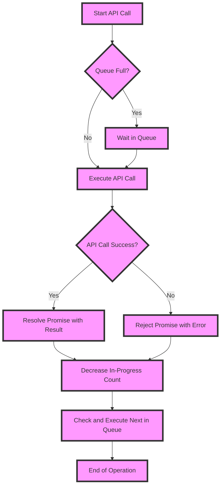

```markdown

```mermaid
graph TD
    A[Start API Call] --> B{Queue Full?}
    B -- Yes --> C[Wait in Queue]
    B -- No --> D[Execute API Call]
    C --> D
    D --> E{API Call Success?}
    E -- Yes --> F[Resolve Promise with Result]
    E -- No --> G[Reject Promise with Error]
    F --> H[Decrease In-Progress Count]
    G --> H
    H --> I[Check and Execute Next in Queue]
    I --> J[End of Operation]

    classDef className fill:#f9f,stroke:#333,stroke-width:4px;
    class A,B,C,D,E,F,G,H,I,J className;
```
```