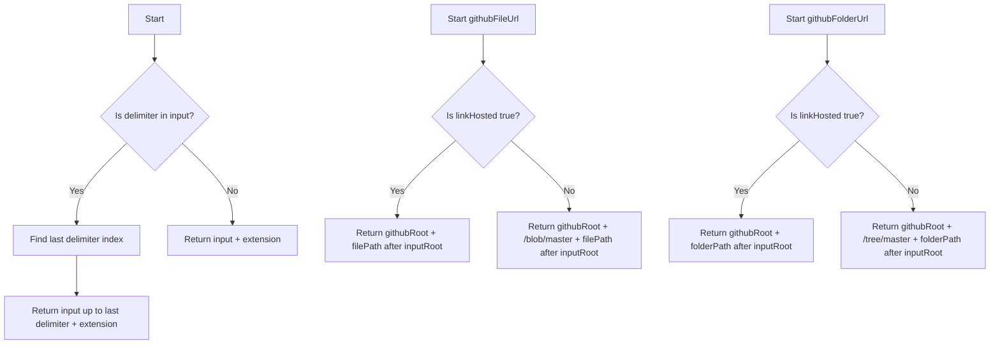

```markdown

```mermaid
graph TD
    A[Start] --> B{Is delimiter in input?}
    B -->|Yes| C[Find last delimiter index]
    B -->|No| D[Return input + extension]
    C --> E[Return input up to last delimiter + extension]

    F[Start githubFileUrl] --> G{Is linkHosted true?}
    G -->|Yes| H[Return githubRoot + filePath after inputRoot]
    G -->|No| I[Return githubRoot + /blob/master + filePath after inputRoot]

    J[Start githubFolderUrl] --> K{Is linkHosted true?}
    K -->|Yes| L[Return githubRoot + folderPath after inputRoot]
    K -->|No| M[Return githubRoot + /tree/master + folderPath after inputRoot]
```
```