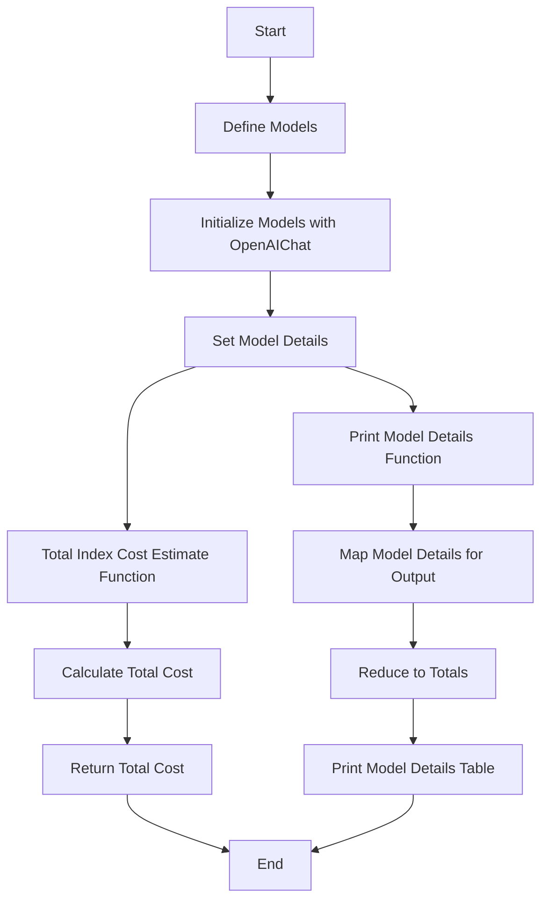

```mermaid
graph TD
    A[Start] --> B[Define Models]
    B --> C[Initialize Models with OpenAIChat]
    C --> D[Set Model Details]
    D --> E[Print Model Details Function]
    D --> F[Total Index Cost Estimate Function]
    E --> G[Map Model Details for Output]
    F --> H[Calculate Total Cost]
    G --> I[Reduce to Totals]
    H --> J[Return Total Cost]
    I --> K[Print Model Details Table]
    J --> L[End]
    K --> L
```
