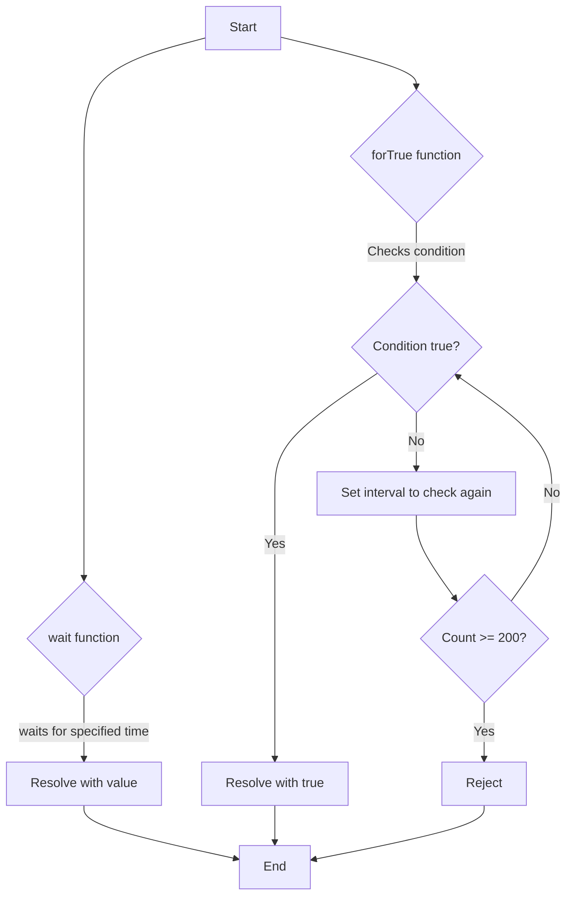

```markdown

```mermaid
graph TD
    A[Start] --> B{wait function}
    B -->|waits for specified time| C[Resolve with value]
    A --> D{forTrue function}
    D -->|Checks condition| E{Condition true?}
    E -->|Yes| F[Resolve with true]
    E -->|No| G[Set interval to check again]
    G --> H{Count >= 200?}
    H -->|Yes| I[Reject]
    H -->|No| E
    C --> J[End]
    F --> J
    I --> J
```
```