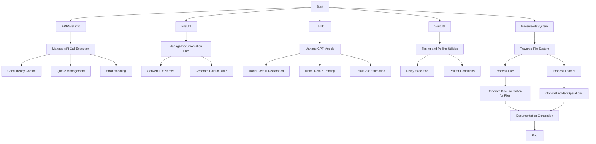

```mermaid
graph TD
    A[Start] --> B[APIRateLimit]
    A --> C[FileUtil]
    A --> D[LLMUtil]
    A --> E[WaitUtil]
    A --> F[traverseFileSystem]

    B --> G[Manage API Call Execution]
    G --> H[Concurrency Control]
    G --> I[Queue Management]
    G --> J[Error Handling]

    C --> K[Manage Documentation Files]
    K --> L[Convert File Names]
    K --> M[Generate GitHub URLs]

    D --> N[Manage GPT Models]
    N --> O[Model Details Declaration]
    N --> P[Model Details Printing]
    N --> Q[Total Cost Estimation]

    E --> R[Timing and Polling Utilities]
    R --> S[Delay Execution]
    R --> T[Poll for Conditions]

    F --> U[Traverse File System]
    U --> V[Process Files]
    U --> W[Process Folders]

    V --> X[Generate Documentation for Files]
    W --> Y[Optional Folder Operations]

    X --> Z[Documentation Generation]
    Y --> Z

    Z --> AA[End]
```