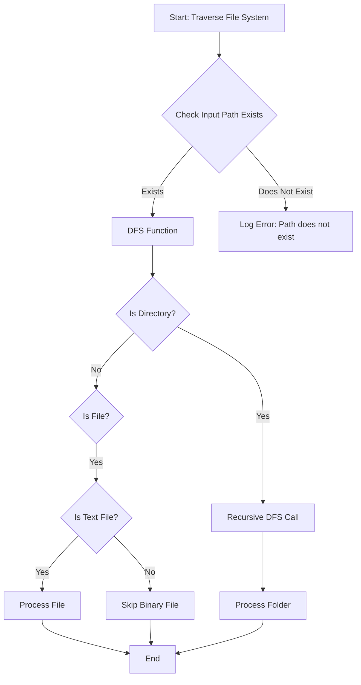

This diagram illustrates the steps taken by the `traverseFileSystem` function within the autodoc project. It starts by checking if the provided input path exists. If it does, it proceeds with a Depth-First Search (DFS) function to traverse directories and files. For each directory, it makes a recursive call to itself, and for each file, it checks if it is a text file before processing it. Binary files are skipped, and folders are processed after their contents. The process ends after all eligible files and folders have been processed.